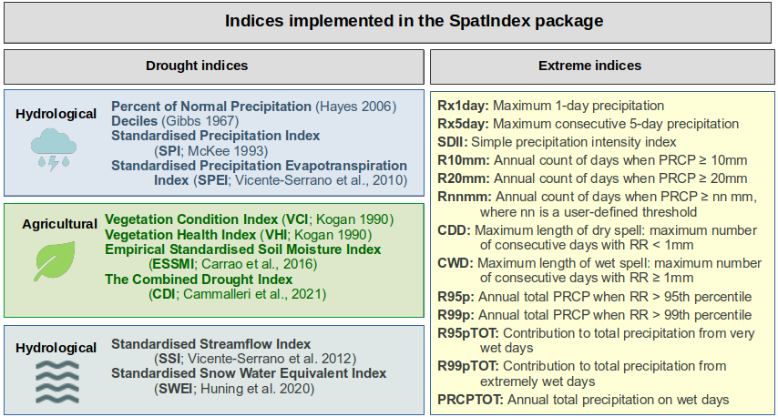
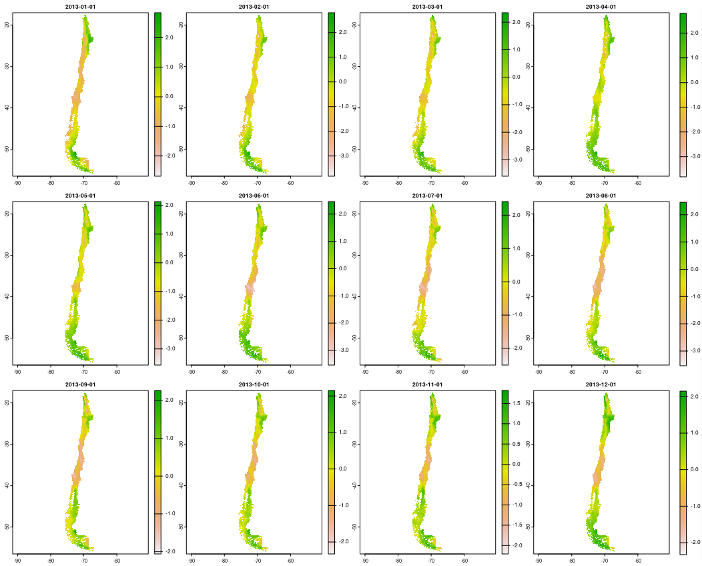
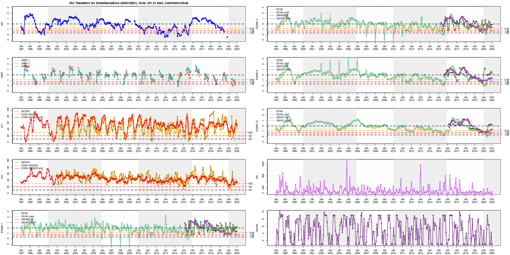

# SpatIndex 

Spatial indices to monitor droughts and global change 

This R package provides a simple way of computing spatially-distributed drought and extreme indices. The users can compute meteorological, agricultural, and hydrological indices as well as the extreme CLIMDEX indices by providing raster files of the required hydroclimatological variables. The drought and extreme indices that are implemented in **SpatIndex** are summarised in the following figure:



### Installation

Install the development version from GitHub:

```r
remotes::install_github("obaezvil/SpatInex")
```

### Drought analysis

The drought indices implemented in the **SpatIndex** package are:

| Index                                                    |    Function name     | 
|----------------------------------------------------------|----------------------|
| Percent of Normal Precipitation                          | spatial_pni()        |
| Deciles                                                  | spatial_deciles()    |
| Standardised Precipitation Index                         | spatial_spi()        |
| Standardised Precipitation Evapotranspiration Index      | spatial_spei()       |
| Vegetation Condition Index                               | spatial_vci()        |
| Temperature Condition Index                              | spatial_tci()        |
| Vegetation Health Index                                  | spatial_vhi()        |
| Empirical Standardised Soil Moisture Index               | spatial_essmi()      |
| z-score (can be used with multiple variables)            | spatial_zscore(´)    |
| Combined Drought Index                                   | spatial_cdi()        |
| Standardised Streamflow Index                            | ssi()                |
| Standardised Snow Water Equivalent Index                 | spatial_swei()       |


If the user wants to calculate the SPI-12 using the reference period 1981--2010, they could do it as follows:

```r
spi_12 <- spatial_spi(P_data, scale = 12,  ref_start = "1981-01", ref_end = "2010-12")
```

Where:

- *P_data*: a 'SpatRaster' object that contains spatially-distributed monthly precipitation data that will be used to calculate the SPI. This 'SpatRaster' must include the dates of the respective layers (they can be set with the function time of the terra package).

- *scale*: Integer value representing the time scale at which the SPI will be computed.

- *ref_start* and *ref_end*: optional values that represent the starting and ending point of the period of reference used for computing the index. The date should be introduced as '\%Y-\%m'. For example: "1989-02".

The following figure shows the spatially distributed SPI-12 values over Chile for 2013 using CR2METv2.5:



This package is very useful to apply diverse drought indices using multiple gridded datasets. As an example, the next figure shows diverse hydrological (SSI and SWEI), agricultural (VCI, VHI, and ESSMI), and meteorological (Percent of Normal and Deciles) indices. These indices were calculated using diverse datasets over the Tascadero catchment (241 km$^2$) in Chile.



### Extreme events analysis

These functions have the same name as the indices. For example, if the user wants to calculate the maximum 1-day precipitation (Rx1day):

```r
rx1day <- Rx1day(rst.path, vct = NULL,  temporal.scale = c("total", "annual"),
                  start.date,  end.date,  date.fmt = "%Y-%m-%d",  pattern = NULL)
```

Where:

- *rst.path* File path to daily raster files for the period of analysis. These files should include the date in any format.

- *vct* Vector file of the study area (Optional). It will be used to crop the spatial extent of the raster files if required. This parameter is set to 'NULL'; therefore, the index will be calculated over the entire raster extent by default.

- *temporal.scale* either 'total' to use all the period of record (i.e., all the files in the parent folder 'rst.path'), or 'annual' to compute the index annually (From Jan to Dec).

- *start.date* Position where the dates of the raster files start. For example, for files named 'ProductA_1989-02-28.tif', the *start.date* will indicate the position where the date starts (i.e., 10).

- *end.date* Position where the dates of the raster files end. For example, for files named 'ProductA_1989-02-28.tif', the *end.date* will indicate the position where the date ends (i.e., 19).

- *date.fmt* Format of the dates included in the file names (default = "%Y-%m-%d").

- *pattern* Set to NULL. Is there a specific pattern to list the raster files?

An example of the implementation of **Rx1day** over Sub-Saharan Africa for 1981--2021 can be observed in the following Figure:


### Vignette

An introductory vignette on how to use the **SpatIndex** package and how to use its functions is coming soon!
